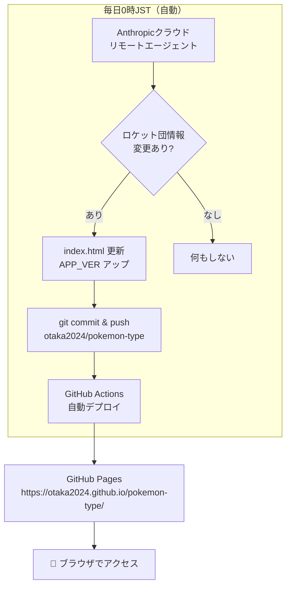

# pokemon-type 仕様書

## 概要
ポケモンGOのタイプ相性チェックとロケット団の手持ちポケモン情報をまとめたWebアプリ。GitHub Pagesで公開。ロケット団情報は毎日自動チェック・自動更新。

## アーキテクチャ



## 動作環境
| 項目 | 内容 |
|------|------|
| ホスティング | GitHub Pages |
| リポジトリ | otaka2024/pokemon-type |
| デプロイ | git push → GitHub Actions 自動デプロイ |
| 自動チェック | Anthropicクラウド リモートエージェント（毎日0時JST） |
| ツール | ~/bin/gh（GitHub CLI） |

## ファイル構成
```
pokemon-type/
└── index.html   # 全コード（タイプ相性表 + ロケット団情報）
```

## 主な機能

### タイプ相性チェック
- 攻撃・防御のタイプ相性を一覧表示
- ポケモンGO向けに最適化

### ロケット団情報
- クリフ・シエラ・アルロ・サカキのリーダー手持ちポケモン
- 下っ端の手持ちポケモン
- 各ポケモンの弱点・有効な攻撃タイプ

## 通知設定
- 変更検知時：**Slack（クロコボット）** の #指示チャンネル に通知
- ntfy.shはクラウド環境でブロックされるため2026-06-29にSlackへ変更

## 現在のデータ（2026年6月29日時点 / Flying Taxi: Taken Over イベント）
| リーダー | 1体目 | 2体目（3択） | 3体目（3択） |
|---------|-------|-------------|-------------|
| クリフ | キバゴ | マタドガス(ガラル)・サーナイト・ゴルーグ | バンギラス・バクーダ・エルレイド |
| シエラ | アマルス | カメックス・フライゴン・ナットレイ | ハガネール・ヘルガー・ミロカロス |
| アルロ | チゴラス | ヤドラン・ハガネール・ギガイアス | リザードン・フーディン・ハッサム |
| サカキ | ペルシアン | カイリキー・ガルーラ・ドサイドン | シャドウレシラム |

## チャット指示
- 通常は自動更新のため不要
- 手動更新が必要な場合：「ロケット団を更新して。クリフは〇〇」
